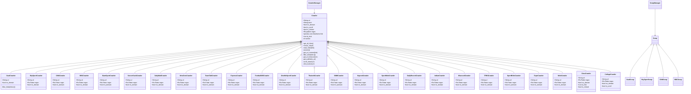

# Web Analysis

```mermaid
classDiagram
class Crawler{
    +String url
    +String word
    +bool no_domain
    +bool is_scroll
    +bool is_clicked
    +Re.pattern regex
    +pandas.core.Dataframe link
    +List id_click
    -int worker
    +get_all_links()
    +check_url(url)
    -read_robot(link)
    -session()
    -get_url_content(link)
    -filter_links(link=[])
    -get_url_link(content)
    -get_sublink(s_url)
    -scroll_down(url)
    -click_button(url)
}

class GoalCrawler{
    +String url
    +bool no_domain
    -filter_links(links=[])
}

class SkySportCrawler{
    +String url
    +Re.Patter regex
    +bool no_domain
}

Crawler <|-- GoalCrawler
Crawler <|-- SkySportCrawler
Crawler <|-- CNNCrawler

class CNNCrawler{
    +String url
    +Re.Patter regex
    +bool no_domain
}

Crawler <|-- BBCCrawler

class BBCCrawler{
    +String url
    +Re.Patter regex
    +bool no_domain
}

Crawler <|-- SiamSportCrawler

class SiamSportCrawler{
    +String url
    +Re.Patter regex
    +bool no_domain
}

Crawler <|-- SoccerSuckCrawler

class SoccerSuckCrawler{
    +String url
    +Re.Patter regex
    +bool no_domain
}

Crawler <|-- DailyMailCrawler
class DailyMailCrawler{
    +String url
    +Re.Patter regex
    +bool no_domain
}

Crawler <|-- NineZeroCrawler
class NineZeroCrawler{
    +String url
    +Re.Patter regex
    +bool no_domain
}

Crawler <|-- TeamTalkCrawler
class TeamTalkCrawler{
    +String url
    +Re.Patter regex
    +bool no_domain
}

Crawler <|-- ExpressCrawler
class ExpressCrawler{
    +String url
    +Re.Patter regex
    +bool no_domain
}
Crawler <|-- Football365Crawler
class Football365Crawler{
    +String url
    +Re.Patter regex
    +bool no_domain
}
Crawler <|-- GiveMeSportCrawler
class GiveMeSportCrawler{
    +String url
    +Re.Patter regex
    +bool no_domain
}
Crawler <|-- ThairathCrawler
class ThairathCrawler{
    +String url
    +Re.Patter regex
    +bool no_domain
}
Crawler <|-- SMMCrawler
class SMMCrawler{
    +String url
    +Re.Patter regex
    +bool no_domain
}
Crawler <|-- KapookCrawler
class KapookCrawler{
    +String url
    +Re.Patter regex
    +bool no_domain
}
Crawler <|-- SportMoleCrawler
class SportMoleCrawler{
    +String url
    +Re.Patter regex
    +bool no_domain
}
Crawler <|-- DailyRecordCrawler
class DailyRecordCrawler{
    +String url
    +Re.Patter regex
    +bool no_domain
}
Crawler <|-- IndianCrawler
class IndianCrawler{
    +String url
    +Re.Patter regex
    +bool no_domain
}
Crawler <|-- KhaosodCrawler
class KhaosodCrawler{
    +String url
    +Re.Patter regex
    +bool no_domain
}
Crawler <|-- TPBSCrawler
class TPBSCrawler{
    +String url
    +Re.Patter regex
    +bool no_domain
}
Crawler <|-- SportBibleCrawler
class SportBibleCrawler{
    +String url
    +Re.Patter regex
    +bool no_domain
}
Crawler <|-- EspnCrawler
class EspnCrawler{
    +String url
    +Re.Patter regex
    +bool no_domain
}
Crawler <|-- NdtvCrawler
class NdtvCrawler{
    +String url
    +Re.Patter regex
    +bool no_domain
}
Crawler <|-- CbssCrawler
class CbssCrawler{
    +String url
    +Re.Patter regex
    +bool no_domain
    +List id_click
    +bool is_clicked
}
Crawler <|-- CollegeCrawler
class CollegeCrawler{
    +String url
    +Re.Patter regex
    +bool no_domain
    +bool is_scroll
}
CrawlerManager -->Crawler
Scrap <|-- GoalScrap
Scrap <|-- SkySportScrap
Scrap <|-- CNNScrap
Scrap <|-- BBCScrap
ScrapManager-->Scrap
```