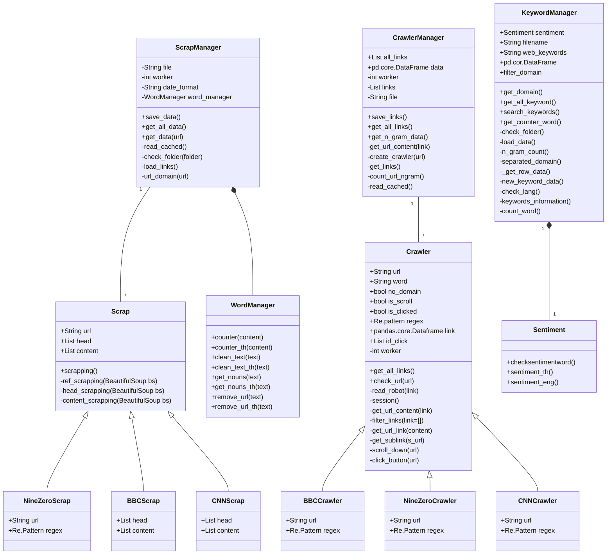

# Web Analysis

```mermaid
classDiagram
class Crawler{
    +String url
    +String word
    +bool no_domain
    +bool is_scroll
    +bool is_clicked
    +Re.pattern regex
    +pandas.core.Dataframe link
    +List id_click
    -int worker
    +get_all_links()
    +check_url(url)
    -read_robot(link)
    -session()
    -get_url_content(link)
    -filter_links(link=[])
    -get_url_link(content)
    -get_sublink(s_url)
    -scroll_down(url)
    -click_button(url)
}

Crawler <|-- BBCCrawler
Crawler <|-- NineZeroCrawler
Crawler <|-- CNNCrawler

class BBCCrawler{
    +String url
    +Re.Pattern regex
}
class CNNCrawler{
    +String url
    +Re.Pattern regex
}
class NineZeroCrawler{
    +String url
    +Re.Pattern regex
}

class Scrap{
    +String url
    +List head
    +List content
    +scrapping()
    -ref_scrapping(BeautifulSoup bs)
    -head_scrapping(BeautifulSoup bs)
    -content_scrapping(BeautifulSoup bs)
}

Scrap <|-- NineZeroScrap
Scrap <|-- BBCScrap
Scrap <|-- CNNScrap

class BBCScrap{
    +List head
    +List content
}
class CNNScrap{
    +List head
    +List content
}
class NineZeroScrap{
    +String url
    +Re.Pattern regex
}


ScrapManager "1"-- "*" Scrap
class ScrapManager{
    -String file
    -int worker
    -String date_format
    -WordManager word_manager
    +save_data()
    +get_all_data()
    +get_data(url)
    -read_cached()
    -check_folder(folder)
    -load_links()
    -url_domain(url)
}
CrawlerManager "1" -- "*" Crawler
class CrawlerManager{
    +List all_links
    +pd.core.DataFrame data
    -int worker
    -List links
    -String file
    +save_links()
    +get_all_links()
    +get_n_gram_data()
    -get_url_content(link)
    -create_crawler(url)
    -get_links()
    -count_url_ngram()
    -read_cached()
}

ScrapManager *-- WordManager

class WordManager{
    +counter(content)
    +counter_th(content)
    +clean_text(text)
    +clean_text_th(text)
    +get_nouns(text)
    +get_nouns_th(text)
    +remove_url(text)
    +remove_url_th(text)
}

class KeywordManager{
    +Sentiment sentiment
    +String filename
    +String web_keywords
    +pd.cor.DataFrame
    +get_domain()
    +get_all_keyword()
    +search_keywords()
    +get_counter_word()
    +filter_domain
    -check_folder()
    -load_data()
    -n_gram_count()
    -separated_domain()
    -_get_row_data()
    -new_keyword_data()
    -check_lang()
    -keywords_information()
    -count_word()
}

class Sentiment{
    +checksentimentword()
    +sentiment_th()
    +sentiment_eng()
}

KeywordManager "1" *-- "1" Sentiment
```